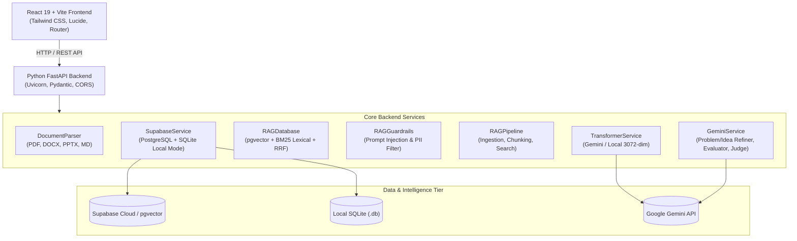

# 🌟 PROJECTLENS AI — AI Project Evaluation & RAG Assistant

> **Turn your project idea into a stronger, smarter, and production-ready solution.**

**ProjectLens AI** is an enterprise-grade AI project evaluation, RAG architecture, and product governance platform. It empowers developers, students, and product teams to formulate problem statements, refine technical architectures, ingest multi-format project documentation (PDF, PPT, PPTX, DOC, DOCX, TXT, MD), query a grounded knowledge base with verified page citations, generate 12-category AI evaluations, simulate Hackathon Judge critiques, and track implementation through an interactive 7-column AI Kanban Board.

---

## 🏗️ Clean Architecture Overview



---

## 📁 Repository Structure

```
hacklens/
├── backend/                        # Python FastAPI Backend
│   ├── data/                       # Local SQLite persistence (Zero-Config mode)
│   ├── routers/                    # REST API Endpoints
│   │   ├── __init__.py
│   │   ├── ai_board.py             # 7-Column AI Board Kanban routes
│   │   ├── chat.py                 # RAG Chat & Diagnostics routes
│   │   ├── documents.py            # Multi-format document upload & parsing
│   │   ├── evaluation.py           # 12-Category evaluation & compare diffs
│   │   ├── projects.py             # Project CRUD & Demo seed routes
│   │   └── rag_metrics.py          # RAG Observability metrics
│   ├── services/                   # Business Logic & AI Engines
│   │   ├── __init__.py
│   │   ├── document_parser.py      # PDF, DOCX, PPTX, TXT extractor & chunker
│   │   ├── gemini_service.py       # LLM generation, synthesis, evaluation & judge
│   │   ├── rag_database.py         # Dense vector + Sparse BM25 + Reciprocal Rank Fusion
│   │   ├── rag_guardrails.py       # Prompt injection shield & PII redaction
│   │   ├── rag_pipeline.py         # End-to-end ingestion and query pipeline
│   │   ├── supabase_service.py     # Dual-engine Supabase & SQLite persistence
│   │   └── transformer_service.py  # 3072-dim embeddings (Gemini + Local Normalized)
│   ├── tests/                      # Automated Verification & Test Suite
│   │   ├── __init__.py
│   │   ├── test_api_endpoints.py   # REST API route verification
│   │   ├── test_rag_pipeline.py    # 8-module pipeline integration tests
│   │   └── test_tuned_rag.py       # Grounded context & scope boundary tests
│   ├── config.py                   # Pydantic Settings & Environment loader
│   ├── main.py                     # FastAPI application entrypoint with lifespan
│   └── requirements.txt            # Python dependencies
│
├── frontend/                       # React 19 + Vite Frontend
│   ├── src/
│   │   ├── components/             # Reusable UI components & modals
│   │   ├── contexts/               # React Auth & State contexts
│   │   ├── layouts/                # Navigation & sidebar shell layouts
│   │   ├── lib/                    # Supabase client & API helpers
│   │   ├── pages/                  # 13 Application views (Wizard, Board, RAG, etc.)
│   │   ├── App.jsx                 # Routing configuration
│   │   └── main.jsx                # Application root
│   ├── index.html                  # HTML entrypoint
│   ├── package.json                # Frontend NPM dependencies
│   └── vite.config.js              # Vite configuration
│
├── supabase/                       # Database Migrations & Schemas
│   ├── migrations/
│   │   └── 20260823000000_init_schema.sql  # Canonical pgvector schema & RLS policies
│   ├── config.toml                 # Supabase CLI config
│   ├── seed.sql                    # Initial seed data
│   └── README.md                   # Supabase setup instructions
│
├── .env.example                    # Global environment template
├── .gitignore                      # Git ignore rules
├── package.json                    # Root script orchestrator
├── pyproject.toml                  # Python package configuration & Pyrefly paths
├── start.js                        # Cross-platform concurrent dev runner
└── README.md                       # Documentation
```

---

## 🚀 Key Features

* **🔐 Authentication & Instant Demo**:
  * Supabase Auth with Google/GitHub OAuth and email login.
  * 1-Click Demo Login pre-loading **CivicLens AI** with documentation, 86/100 score, and AI Board.
* **📝 5-Step Project Wizard with Gemini Assistants**:
  * Step 01: Problem statement with character count + *"Need help defining the problem?"* AI assistant.
  * Step 02: Initial solution idea with *"Improve my idea"* architecture assistant.
  * Step 03: Structured requirements builder (Functional, Technical, Target Users, Constraints).
  * Step 04: Multi-format document upload zone (PDF, PPT, PPTX, DOC, DOCX, TXT, MD).
  * Step 05: Project summary preview + 1-click AI Evaluation launch.
* **📚 Grounded RAG Pipeline & Multi-Format Ingestion**:
  * Semantic text extraction across PDF, DOCX, PPTX, TXT, and Markdown.
  * 800-character chunking preserving page numbers and section headers.
  * 3072-dimensional vector embeddings with Gemini embedding models.
  * Grounded Chatbot citing exact document name, page number, and highlighted excerpt with zero hallucination.
* **🏆 12-Category AI Evaluation & Hackathon Judge Mode**:
  * 12 scoring dimensions (Problem Clarity, Problem Importance, Solution Quality, Innovation, Technical Feasibility, User Value, Requirement Completeness, Scalability, Security, RAG Quality, Implementation Feasibility, Overall Strength).
  * Overall Score Ring (0–100), *"What's Strong"*, *"What's Missing"*, and Risk Matrix.
  * Prioritized Improvement Action Plan (`HIGH`, `MEDIUM`, `LOW`).
  * **"Judge My Project"** Hackathon Judge Mode (Score, verdict, tough questions, criticisms, presentation tips).
  * **"Compare Evaluations"** delta diff tracking iterative score changes (`+14.0 pts`).
* **📋 7-Column Interactive AI Kanban Board**:
  * Columns: `PROBLEM`, `IDEA`, `REQUIREMENTS`, `AI INSIGHTS`, `RISKS`, `IMPROVEMENTS`, `NEXT STEPS`.
  * Move cards across columns, pin cards, toggle completion, edit text, and synchronize directly from AI evaluations.
* **📊 RAG Quality Observability Dashboard**:
  * Developer panel monitoring indexed documents, total chunks, vector health, citation accuracy rate (`100%`), and faithfulness verification.

---

## 🛠️ Technology Stack

* **Frontend**: React 19, Vite, Tailwind CSS, Lucide React, React Router.
* **Backend**: Python (FastAPI, Uvicorn), `google-genai` (Gemini 2.5 Flash, `text-embedding-004`), `pypdf`, `python-docx`, `python-pptx`, `pydantic-settings`.
* **Database & Storage**: Supabase (PostgreSQL with `pgvector`, Row Level Security) + Zero-Config Local SQLite fallback.

---

## 📦 Getting Started

### 1. Prerequisites
* **Node.js** (v18+)
* **Python** (v3.10+)

### 2. Environment Configuration
Copy `.env.example` to `.env`, `backend/.env`, and `frontend/.env`:

```bash
# In backend/.env
SUPABASE_URL=https://your-project.supabase.co
SUPABASE_PUBLISHABLE_KEY=your_supabase_publishable_key
SUPABASE_SECRET_KEY=your_supabase_secret_key
GEMINI_API_KEY=your_gemini_api_key
PORT=8000

# In frontend/.env
VITE_SUPABASE_URL=https://your-project.supabase.co
VITE_SUPABASE_PUBLISHABLE_KEY=your_supabase_publishable_key
VITE_API_BASE_URL=http://localhost:8000
```

### 3. Install Dependencies & Run

```bash
# 1. Install backend dependencies in your Python virtual environment
pip install -r backend/requirements.txt

# 2. Install frontend dependencies
cd frontend && npm install && cd ..

# 3. Launch both Frontend & Backend concurrently
npm start
# Or: node start.js
```

### 4. Running Automated Tests

```bash
# Run API Endpoint tests
python backend/tests/test_api_endpoints.py

# Run RAG Pipeline & Ingestion integration tests
python backend/tests/test_rag_pipeline.py

# Run Grounded RAG & Scope Boundary tests
python backend/tests/test_tuned_rag.py
```

### 5. Open in Browser
* **Frontend Application**: `http://localhost:5173/`
* **Backend API Docs (Swagger UI)**: `http://localhost:8000/docs`

---

## 📜 Supabase Database Schema
To set up PostgreSQL tables, pgvector vector indices, and Row Level Security policies on Supabase, execute the SQL script in:
`supabase/migrations/20260823000000_init_schema.sql` (see [supabase/README.md](file:///c:/Users/lenovo/Desktop/New%20folder/hacklens/supabase/README.md) for instructions).

---

## 📄 License
MIT License © 2026 PROJECTLENS AI.
